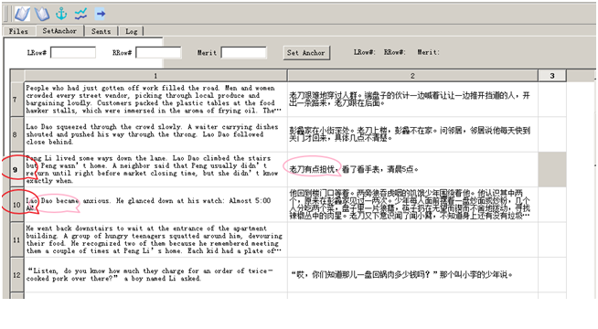
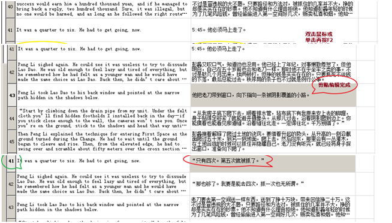
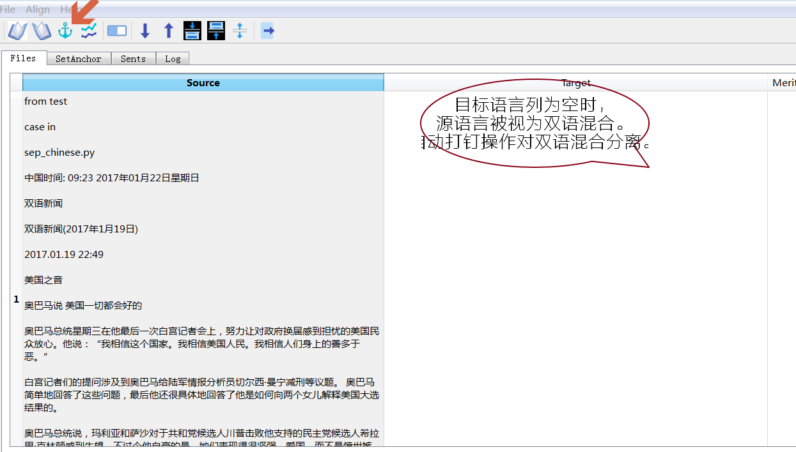
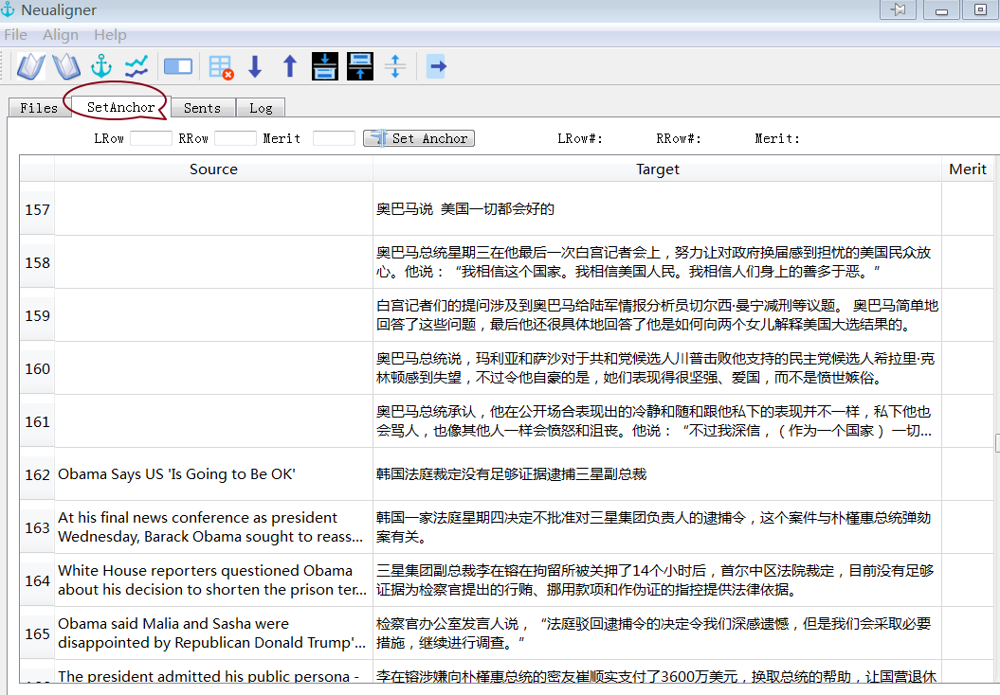
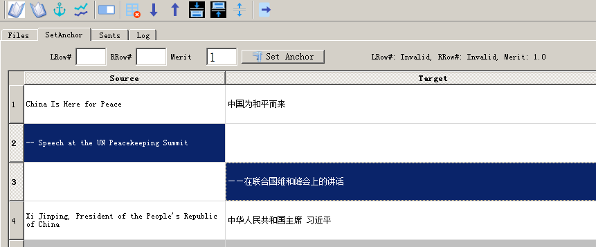

Ptextpad基本操作示范
==============================

.. |setanchorbut| image:: _static/setanchorbut.png
    :width: 40pt

.. |alignbut| image:: _static/alignbut.png
    :width: 40pt

备注： 打钉键（|setanchorbut|）仅在文件卡（File tab）有效；对齐键（|alignbut|）仅在段卡（Para tab）有效。

下面以Folding_Beijing_ch1-en.txt和Folding_Beijing_ch1-zh.txt两个文件示范各步的操作。启动Ptextpad beta。

载入
--------------------------

1. 点击载入左边的源文件（快捷键Ctrl-1）

.. image:: _static/loadfile1.png
    :width: 500px
    :align: center
    :alt: 载入源文件

2. 点击载入右边的目标文件（快捷键Ctrl-2）

.. image:: _static/loadfile2.png
    :width: 500px
    :align: center
    :alt: 载入目标文件

“打钉”、除钉
--------------------------

3.	点击自动“打钉”（快捷键Ctrl-A）

.. image:: _static/setanchors.png
    :width: 500px
    :align: center
    :alt: 打钉

4.	自动打钉完成后，程序会自动切换至手动打钉卡SetAnchor Tab。同时一些质量比较好的段段对齐会被标出来。

.. image:: _static/setanchortab.png
    :width: 500px
    :align: center
    :alt: 打钉Tab

5.	第三列的指标可直接输入进行人工打钉或除钉

.. image:: _static/setanchortabcol3.png
    :width: 500px
    :align: center
    :alt: 打钉Tab第三列

6.	错位的对应段可在打钉卡SetAnchor Tab的顶部设置。如下图的左10行（LRow#=10）和右9行（RRow#=9）是对应的。

7.	输入行号和指标值后点击“Set Anchor”键。

.. image:: _static/setanchortabtop.png
    :width: 500px
    :align: center
    :alt: 打钉Tab手动打钉

8.	打钉完成。被打钉行的上下行亦被调整。

.. image:: _static/setanchortab_complete.png
    :width: 500px
    :align: center
    :alt: 打钉Tab手动打钉完成

9.	搜索其他需要调整的地方进行打钉。

.. image:: _static/setanchortab_etal.png
    :width: 500px
    :align: center
    :alt: 打钉Tab其他

分拆
--------------------------

10. 分拆： 手动编辑或用快键 Ctrl+S

    有时目标译文合并了对应原文的两段或多段。此时则需要对单元进行手动编辑，或用快捷键Ctrl+S。

.. image:: _static/setanchortab_edit.png
    :width: 500px
    :align: center
    :alt: 打钉Tab编辑

11.	分拆完成

导出打过钉的段
--------------------------

12.	导出打过钉的段

    在菜单里选File，再选Export Paras（导出段）。可在记录标Log里查看文件位置。

.. image:: _static/setanchortabexport.png
    :width: 500px
    :align: center
    :alt: 打钉Tab导出

导入csv、txt、xls、xlsx、tmx文件
-----------------------------------------

13. 导入csv、txt、xls、xlsx、tmx文件至段卡（打钉卡Anchor Tab）

在菜单里选File，再选Import Paras（导入段）

.. image:: _static/import_to_paras.png
    :width: 500px
    :align: center
    :alt: 导入段

导入的csv、txt、xls、xlsx至少需含两列，第三列可选。

载入双语混合文件
-------------------------

14. 载入双语混合文件

目标语言文件为空时，源语言文件被视为双语混合文件。

.. |setanchorbut| image:: _static/setanchorbut.png
    :width: 20pt

.. |alignbut| image:: _static/alignbut.png
    :width: 20pt

自动打钉操作（|setanchorbut|）此时为分离操作。点击自动打钉（|setanchorbut|）键后，转打钉卡查看分离的中英文。

.. image:: _static/sep_chinese2.png
    :width: 500px
    :align: center
    :alt: 双语混合文件分离

下一步可以点击对齐键（|alignbut|）后在句卡里查看对齐结果及导出记忆库tmx文件。

导入网页（可选xpath）
-------------------------

15. 导入网页（可选xpath）

选菜单里File、Import URL/Xpath。Pagefetcher弹出。如下图。

.. image:: _static/import_urlxpath.png
    :width: 500px
    :align: center
    :alt: Pagefetcher弹出

输入网址及Xpath后点击Go。（如不知道如何设置xpath，可设为空。）稍候片刻后，双语文本出现在Pagefetcher。

.. image:: _static/url_go.png
    :width: 500px
    :align: center
    :alt: 输入网址及Xpath后点击Go

再点击最下面的Send to Anchor tab and close this page。双语内容被分离并送至Anchor tab。做一些打钉调整后就可以句句对齐及导出tmx记忆库。如下图。

批量删除行
-------------------------

16. 批量删除行

在未选择行的情况下，删除键（|delbut|）删除当前行。

.. image:: _static/delete1.png
    :width: 500px
    :align: center
    :alt: 删除键

如需删除多行，则可以用鼠标点击左边的行数目字，可用Ctrl+加点击多选独立的行或Shift+加点击选连续的多行。然后点击删除键。

.. image:: _static/delete3.png
    :width: 500px
    :align: center
    :alt: 多选删除

批量设置对齐指标数
-------------------------

17. 批量设置对齐指标数

同样，在没有选择行的情况下，指标设置键（|setmerits|）只对当前行生效。而在Ctrl+加点击多选独立的行或Shift+加点击选连续的多行后，点击指标设置键会将选择了的行置0或1。

.. image:: _static/batchmerits.png
    :width: 500px
    :align: center
    :alt: 多选设置对齐指标

选定多行后句句对齐
-------------------------

18. 选定多行后句句对齐

句句对齐后有时需要微调。可选定几行：鼠标拉选行号或点击一行后再按住Shift或Control键点击选定数行， 如下图：

.. image:: _static/selected_rows_align1a.png
    :width: 500px
    :align: center
    :alt: 选定多行

再点击对齐键（|alignbut|），Ptextpad将重新处理选定行的句句对齐：

.. image:: _static/selected_rows_align2a.png
    :width: 500px
    :align: center
    :alt: 选定多行句句对齐

空格键行数上屏及回车键设置打钉
--------------------------------

19. 空格键行数上屏及回车键设置打钉

手动打钉时需要手动输入行号数，此时可以利用空格键直接选定LRow# 和 RRow#，如下图，先用鼠标点击选好一个表单元（第2行左列），再按住Control点击鼠标选定另一个表单元（第3行右列）。

按下空格键后LRow# 和 RRow#处就被赋了2、3，如下图：

.. image:: _static/tap_row_numbers2a1.png
    :width: 500px
    :align: center
    :alt: 按下空格键

确定指标值（Metric）无误即可按下回车键完成打钉操作，如下图：

.. image:: _static/tap_row_numbers3a.png
    :width: 500px
    :align: center
    :alt: 回车键完成打钉操作
