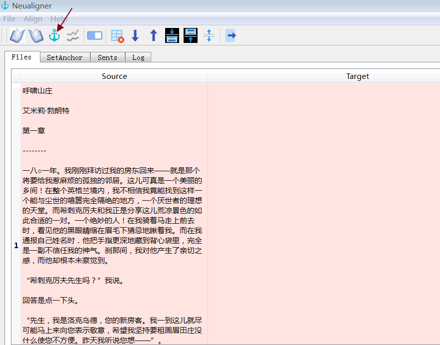

用途
----------------------------------------

Ptextpad(原名 Neualigner)是一款双语对齐软件。支持的导入文件格式包括段段csv、txt、xls、xlsx、tmx、双语自由混合格式、字幕srt/ass格式及单语pdf、docx、epub、xml、html、htm以及Zip压缩过的txt、csv、xml、html、htm。 Neualigner可导出csv、txt、xlsx及tmx格式。

设计理念
----------------------------------------

Ptextpad将对齐分成两步：段段“打钉”及句句对齐。段段层面上的打钉操作可以加速第二步的自动句句对齐的速度及质量。 Ptextpad支持自动“打钉”，也可以手动打钉。

Ptext 0.1.0a0
------------------------
* PyQt5
* 大重组

Neualigner 0.6.3版
-------------------------------

* 新增载入pdf格式文件功能
* 修正0.6.2版双语单文件打钉Bug

Neualigner 0.6.2版
----------------------------------------

* 新增选定行后句句对齐（类似Abbyy Aligner的F5快捷键）
* 新增手动打钉时选好行后可按空格快捷键将行号数送至LRow#、RRow#（无需键入数字）即可用回车快捷键打钉（无需用鼠标点击打钉钮）

请参看基本用法示范里第18、19条。

Neualigner 0.6版
----------------------------------------

* 新增直接获取双语网页打钉对齐
* 新增多行删除及打钉指标值置0置1

请参看基本用法示范里第15、16、17条。

主要功能
----------------------------------------

* 简约图形界面
* 直接编辑，支持常用快捷键（如Ctrl+C拷贝、Ctrl+X、Ctrl+V、Ctrl+A、 Ctrl+Z等等）
* 打钉
* 各种快捷键（移动，合并，拆分等）
* 选择性对齐
* 导入/导出tmx记忆库格式文件

主要术语
----------------------------------------

* 卡（Tab）： 图形界面含四个卡。

 - 文件卡（File tab）用于编辑文件用。

 - 段卡（Para tab）亦名打钉卡（Anchor tab）用于打钉操作。

 - 句卡（Sent tab）用于检查句句对齐的结果及必要时进行微调。

 - 日志卡（Log tab）里可查看程序运行的状态及各种信息（如输出文件的位置等）。

* 指标（Merit）

段卡的第三列里用于显示对齐质量的数字。大于零表示左右两段被打钉定位。

Ptextpad基本操作示范
==============================
下面以Folding_Beijing_ch1-en.txt和Folding_Beijing_ch1-zh.txt两个文件示范各步的操作。启动Ptextpad beta。

载入
--------------------------

1. 点击载入左边的源文件（快捷键Ctrl-1）

.. image:: _static/loadfile1.png
    :width: 500px
    :align: center
    :alt: 载入源文件

2. 点击载入右边的目标文件（快捷键Ctrl-2）

.. image:: _static/loadfile2.png
    :width: 500px
    :align: center
    :alt: 载入目标文件

“打钉”、除钉
--------------------------

3.	点击自动“打钉”（快捷键Ctrl-A）

4.	自动打钉完成后，程序会自动切换至手动打钉卡SetAnchor Tab。同时一些质量比较好的段段对齐会被标出来。

.. image:: _static/setanchortab.png
    :width: 500px
    :align: center
    :alt: 打钉Tab

5.	第三列的指标可直接输入进行人工打钉或除钉

.. image:: _static/setanchortabcol3.png
    :width: 500px
    :align: center
    :alt: 打钉Tab第三列

6.	错位的对应段可在打钉卡SetAnchor Tab的顶部设置。如下图的左10行（LRow#=10）和右9行（RRow#=9）是对应的。

.. image:: _static/setanchortabmisaligned.png
    :width: 500px
    :align: center
    :alt: 打钉Tab顶部

7.	输入行号和指标值后点击“Set Anchor”键。

.. image:: _static/setanchortabtop.png
    :width: 500px
    :align: center
    :alt: 打钉Tab手动打钉

8.	打钉完成。被打钉行的上下行亦被调整。

9.	搜索其他需要调整的地方进行打钉。

.. image:: _static/setanchortab_etal.png
    :width: 500px
    :align: center
    :alt: 打钉Tab其他

分拆
--------------------------

10. 分拆： 手动编辑或用快键 Ctrl+S

    有时目标译文合并了对应原文的两段或多段。此时则需要对单元进行手动编辑，或用快捷键Ctrl+S。

.. image:: _static/setanchortab_edit.png
    :width: 500px
    :align: center
    :alt: 打钉Tab编辑

11.	分拆完成

.. image:: _static/setanchortab_editcomplete.png
    :width: 500px
    :align: center
    :alt: 打钉Tab编辑完成

导出打过钉的段
--------------------------

12.	导出打过钉的段

    在菜单里选File，再选Export Paras（导出段）。可在记录标Log里查看文件位置。

.. image:: _static/setanchortabexport.png
    :width: 500px
    :align: center
    :alt: 打钉Tab导出

导入csv、txt、xls、xlsx、tmx文件
-----------------------------------------

13. 导入csv、txt、xls、xlsx、tmx文件至段卡（打钉卡Anchor Tab）

在菜单里选File，再选Import Paras（导入段）

.. image:: _static/import_to_paras.png
    :width: 500px
    :align: center
    :alt: 导入段

导入的csv、txt、xls、xlsx至少需含两列，第三列可选。

载入双语混合文件
-------------------------

14. 载入双语混合文件

目标语言文件为空时，源语言文件被视为双语混合文件。

.. image:: _static/sep_chinese1.png
    :width: 500px
    :align: center
    :alt: 载入双语混合文件

.. |setanchorbut| image:: _static/setanchorbut.png
    :width: 20pt

.. |alignbut| image:: _static/alignbut.png
    :width: 20pt

自动打钉操作（|setanchorbut|）此时为分离操作。点击自动打钉（|setanchorbut|）键后，转打钉卡查看分离的中英文。

.. image:: _static/sep_chinese2.png
    :width: 500px
    :align: center
    :alt: 双语混合文件分离

下一步可以手动打钉，然后点击对齐键（|alignbut|）后在句卡里查看对齐结果及导出记忆库tmx文件。

导入网页（可选xpath）
-------------------------

15. 导入网页（可选xpath）

选菜单里File、Import URL/Xpath。Pagefetcher弹出。如下图。

.. image:: _static/import_urlxpath.png
    :width: 500px
    :align: center
    :alt: Pagefetcher弹出

输入网址及Xpath后点击Go。（如不知道如何设置xpath，可设为空。）稍候片刻后，双语文本出现在Pagefetcher。

.. image:: _static/url_go.png
    :width: 500px
    :align: center
    :alt: 输入网址及Xpath后点击Go

再点击最下面的Send to Anchor tab and close this page。双语内容被分离并送至Anchor tab。做一些打钉调整后就可以句句对齐及导出tmx记忆库。如下图。

.. image:: _static/url-result.png
    :width: 500px
    :align: center
    :alt: 双语内容被分离

批量删除行
-------------------------

16. 批量删除行

.. |delbut| image:: _static/delbut.png
    :width: 20pt

在未选择行的情况下，删除键（|delbut|）删除当前行。

.. image:: _static/delete1.png
    :width: 500px
    :align: center
    :alt: 删除键

如需删除多行，则可以用鼠标点击左边的行数目字，可用Ctrl+加点击多选独立的行或Shift+加点击选连续的多行。然后点击删除键。

批量设置对齐指标数
-------------------------

17. 批量设置对齐指标数

.. |setmerits| image:: _static/setmerits.png
    :width: 20pt

同样，在没有选择行的情况下，指标设置键（|setmerits|）只对当前行生效。而在Ctrl+加点击多选独立的行或Shift+加点击选连续的多行后，点击指标设置键会将选择了的行置0或1。

.. image:: _static/batchmerits.png
    :width: 500px
    :align: center
    :alt: 多选设置对齐指标

选定多行后句句对齐
-------------------------

18. 选定多行后句句对齐

句句对齐后有时需要微调。可选定几行：鼠标拉选行号或点击一行后再按住Shift或Control键点击选定数行， 如下图：

.. image:: _static/selected_rows_align1a.png
    :width: 500px
    :align: center
    :alt: 选定多行

再点击对齐键（|alignbut|），Ptextpad将重新处理选定行的句句对齐：

空格键行数上屏及回车键设置打钉
--------------------------------

19. 空格键行数上屏及回车键设置打钉

手动打钉时需要手动输入行号数，此时可以利用空格键直接选定LRow# 和 RRow#，如下图，先用鼠标点击选好一个表单元（第2行左列），再按住Control点击鼠标选定另一个表单元（第3行右列）。

.. image:: _static/tap_row_numbers1a.png
    :width: 500px
    :align: center
    :alt: 选定表单元

按下空格键后LRow# 和 RRow#处就被赋了2、3，如下图：

确定指标值（Merit）无误即可按下回车键完成打钉操作，如下图：

使用案例及操作示范
==============================

英中双语单文件
--------------------------

以双语《呼啸山庄》第一章为例。（Wuthering_Heights_ch1_zh-en.txt 文件可以在程序目录里的 test_files\files_for_testing_load目录里找到。）

    呼啸山庄

    艾米莉·勃朗特

    第一章

    一八○一年。我刚刚拜访……
    ……比起来是多么擅长交际啊，这可真是惊人。

    Wuthering Heights

    Emily Bront

    Chapter 1

    1801—I have just returned...
    ...astonishing how sociable I feel myself compared with him.

此例模拟章章对照的双语资料。段段对照的双语资料以此类推。

首先启动Ptextpad。

* 载入文件

点击载入文件1（快捷键Ctrl+1），文件2留空，点击自动打钉操作（|setanchorbut|），Ptextpad会对双语文件做分离处理。

* 自动打钉

自动打钉的结果并不理想。（自动打钉键在单文件双语载入时是做分离键使用的。）

我们用手动打钉。

* 手工打钉（微调）

    * 下猛药大幅调节，按空格将行数上屏

先点击选定第3行左列。再按空格键。“3”被置入LRow处。

滚动到英文处的Chapter 1处。点击选定第27行右列。再按空格键。“27”被置入RRow处。

.. image:: _static/usecase1RRow27.png
    :width: 500px
    :align: center
    :alt: 第27行右列

Merit置为1。

.. image:: _static/usecase1Merit1.png
    :width: 500px
    :align: center
    :alt: 第27行右列

按回车键对3-27进行打钉后：

.. image:: _static/usecase13-27.png
    :width: 500px
    :align: center
    :alt: 进行3-27打钉

往下滚动到27行处。选定左右表单元（先点击28行左列，再按住Ctrl键点击27行右列），再按空格键。27、28上屏：

.. image:: _static/usecase28-27.png
    :width: 500px
    :align: center
    :alt: 进行28-27打钉

* 回车打钉

按回车键打钉：

* 固定已经对好的段落

可以看到，第29行已经对好，可以顺便点击指标开关键（|setmerits|）打钉。

.. image:: _static/usecase29anchor.png
    :width: 500px
    :align: center
    :alt: 进行29-29打钉

* 句句对齐

点击对齐键（|alignbut|)句句对齐。完成后会自动跳至句卡（Sents Tab）。滚动目测一下可以发现92行处的脚注导致从第84行开始的位移。

.. image:: _static/usecase1footnote.png
    :width: 500px
    :align: center
    :alt: 脚注导致位移

先合并（Mergeup）左列的83、84行、再删除84行：

.. image:: _static/usecase1row83-84merge.png
    :width: 500px
    :align: center
    :alt: 合并83、84行

将【You might as well leave a stranger with a brood of tigers!'】一句上移至行号小于含脚注的行号。并删掉一些重复的句子。

.. image:: _static/usecase1rowfoornoteadj.png
    :width: 500px
    :align: center
    :alt: 含脚注的行号

先点击行号85，在按住Ctrl后点击行号89，选定85-89行

.. image:: _static/usecase1rowfoornote85-89.png
    :width: 500px
    :align: center
    :alt: 选定85-89行

点击对齐键（|alignbut|）选择性对齐85-89行

* 导出tmx记忆库

直接从网页剪贴源语言文本及目标语言文本：2016年美国的人权纪录
----------------------------------------------------------------------
2016年美国的人权纪录，英文版网址：http://wap.chinadaily.com.cn/2017-03/10/content_28501838.htm。 中文版网址：http://www.chinanews.com/gn/2017/03-09/8169614.shtml。

启动Ptextpad。

* 在文件卡（Filel tab）左列贴入源语言文本
    在浏览器里打开（2016年美国的人权纪录英文版） http://wap.chinadaily.com.cn/2017-03/10/content_28501838.htm, 点击中文、Ctrl+A、Ctrl+C 将所有文本拷入系统剪贴板。双击Ptextpad的文件卡左列，Ctrl+V贴入系统剪贴板里的文本。除正文外会有一些别乱七八糟的东西，无需理会。我们在打钉时一并处理。

    在文件卡（Files tab）右列贴入目标语言文本。
    同样，在Ptextpad的文件卡右列贴入人权纪录中文版网页 http://www.chinanews.com/gn/2017/03-09/8169614.shtml 内容。

* 点击打钉键(|setanchorbut|)（快捷键Ctrl+A）
    跳出的对话框选择No。（网页里有很多别的乱七八糟的东西，自动打钉效果可能不好。选Yes试试自动打钉也没什么问题。）

    .. image:: _static/usecase2autoanchoringno.png
        :width: 500px
        :align: center
        :alt: 打钉键

    Ptextpad跳到打钉卡（SetAnch tab）：

    .. image:: _static/usecase2setanchortab.png
        :width: 500px
        :align: center
        :alt: 打钉卡

* 手动打钉
    找到英文的正文标题“Human Rights Record of the United States in 2016”，点击6行左列选定，再按空格键。6字上屏。

    .. image:: _static/usecase2setleft6.png
        :width: 500px
        :align: center
        :alt: 6字上屏

    同样，找到中文的正文标题“2016年美国的人权纪录”，点击11行右列选定，再按空格键。11字上屏。同时将指标数Merit设为1.

    .. image:: _static/usecase2setright11.png
        :width: 500px
        :align: center
        :alt: 11字上屏

    按回车键或点击指标设置键（|setmerits|）进行手动打钉操作。Ptextpad调整对齐后：

    .. image:: _static/usecase2manualsetanchor.png
        :width: 500px
        :align: center
        :alt: 手动打钉操作

    滚动到英文正文结尾59行处。（可参考原网页文本。）选定左列，按空格键，59上屏。

    .. image:: _static/usecase2setleft59.png
        :width: 500px
        :align: center
        :alt: 59上屏

    滚动到英文正文结尾157行处。（可参考原网页文本。原中文网页含“2016年美国侵犯人权事记”）选定左列，按空格键，157上屏。

    .. image:: _static/usecase2setright157.png
        :width: 500px
        :align: center
        :alt: 157上屏

    按回车键或点击指标设置键（|setmerits|）进行手动打钉操作。Ptextpad调整对齐后：

    .. image:: _static/usecase2manualsetanchor157.png
        :width: 500px
        :align: center
        :alt: 手动打钉操作

    点击行号158，下滚到末尾，按Shift点击行号401，选定158行至401行：

    .. image:: _static/usecase2select158_401.png
        :width: 500px
        :align: center
        :alt: 选定158行至401行

    点击删除键（|delbut|）删除158行至401行：

    .. image:: _static/usecase2rows58_401deleted.png
        :width: 500px
        :align: center
        :alt: 删除158行至401行

    稍微目测一下发现，第五节（147行）、第六节（153行）很幸运地已经对好，点击147行的左列单元或右列单元再点击指标设置键（|setmerits|）打钉；点击153行的左列单元或右列单元再点击指标设置键（|setmerits|）打钉：

    .. image:: _static/usecase2manualanchorrows147_153.png
        :width: 500px
        :align: center
        :alt: 删除158行至401行

    中文第四节末尾有多个尾注。有必要在英文第四节正文尾个中文第四节正文尾打一个钉，以免尾注干扰下一步的句句对齐。点击选定第146行左列单元，按空格146上屏。滚动到125行，点击选定第125行右列单元，按空格125上屏。按回车键或点击指标设置键（|setmerits|）进行手动打钉操作。Ptextpad调整对齐后：

    .. image:: _static/usecase2manualanchorrows146_125.png
        :width: 500px
        :align: center
        :alt: 手动打钉操作

    同样，在第四节标题及第三节正文末打钉消除尾注对句句对齐的干扰。

    .. image:: _static/usecase2section3section4.png
        :width: 500px
        :align: center
        :alt: 第四节标题及第三节正文末

    对其他节末的尾注做同样打钉处理。

    最后，由于中文里含目录而英文并无目录。因此需在中文目录前后打钉处理。可在英文“Forward“和中文“前言”之间打一个钉，再在英文“March 2017”和“中文2017年3月”之间打一个钉。Ptextpad调整对齐后：

    .. image:: _static/usecase2manualanchortoc.png
        :width: 500px
        :align: center
        :alt: 中文目录前后打钉

    至此，打钉完成。可删掉正文前的东西及尾注。

* 点击对齐键（|alignbut|） 句句对齐

* 选择数行后重新句句对齐

* 导出
